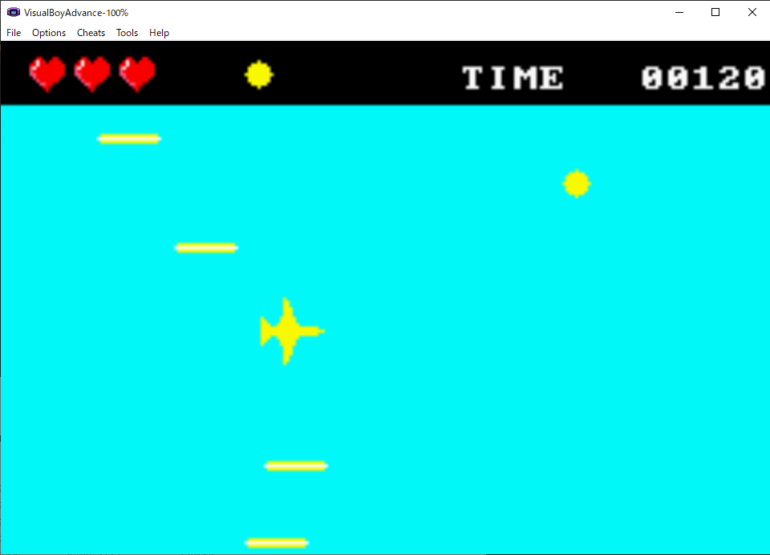
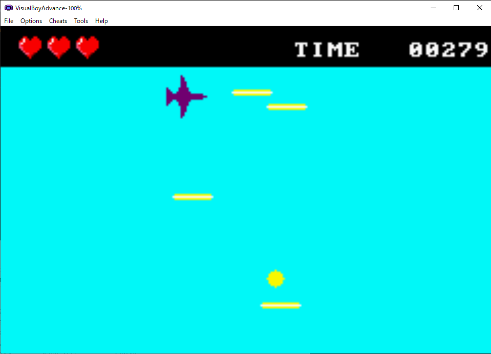

# ドットSTG

- 十字キーで飛行機を動かしてレーザを避けながら4つコインを集めるゲームです。

## 動作内容

- 最初はライフ（左上のハートマーク）が4つありますが、ランダム生成されるレーザに当たるごとに1つ減ります。0になるとゲームオーバーです。
- その隣に獲得したコインが表示されます。4つ集めるとクリアになります。
- 右上にタイマーが表示されプレイ時間が記録されます。



## リポジトリ内容

1. ```img```: スクリーンショット

2. ```src```: ソースコード

3. ```README.md```: このファイル

## 注

- 過去の開発（一部講義内容）をまとめたものです。
